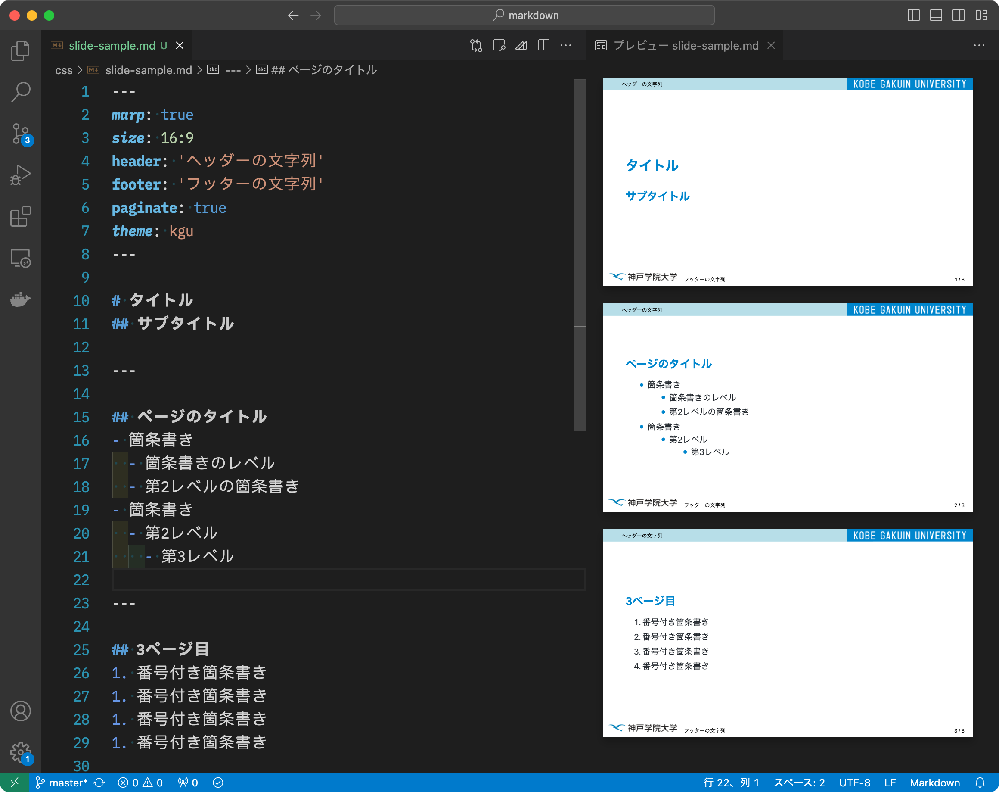

# Marp KGU theme

## 使い方
- Visual Studio Code に拡張機能「Marp for VS Code」をインストールする
- Visual Studio Code の設定にある「Markdown > Marp: Themes」に次の項目を追加する

~~~
https://raw.githubusercontent.com/rinsaka/marp-kgu-theme/master/kgu.css
~~~

## サンプルスライド
- 拡張子 md のファイルを作成し，次のような内容を保存して，プレビューする（または，PDFにエクスポートする）

~~~
---
marp: true
size: 16:9
header: 'ヘッダーの文字列'
footer: 'フッターの文字列'
paginate: true
theme: kgu
---

# タイトル
## サブタイトル

---

## ページのタイトル
- 箇条書き
  - 箇条書きのレベル
  - 第2レベルの箇条書き
- 箇条書き
  - 第2レベル
    - 第3レベル

---

## 3ページ目
1. 番号付き箇条書き
1. 番号付き箇条書き
1. 番号付き箇条書き
1. 番号付き箇条書き
~~~

# Visual Stdio Code キャッシュの削除方法
- 本リポジトリの kgu.css を更新しても，Visual Stido Code のキャッシュが残っていると，スタイルが更新されない．
- その場合は Visual Studio Code のキャッシュを削除するとよい．
- macOS ではキャッシュが ~Library/Application Support/Code/Cache/Cache_Data にあるので，その中のファイルとディレクトリをまとめて削除すると良い．
