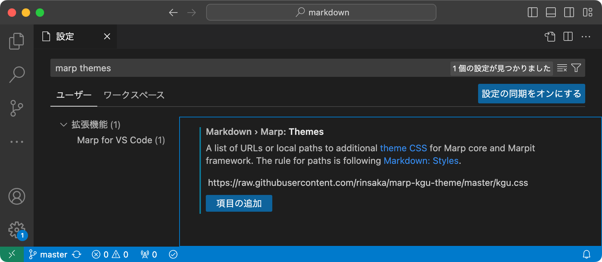

# タイトル
## サブタイトル

---

## ページのタイトル
- 箇条書き
  - 箇条書きのレベル
  - 第2レベルの箇条書き
- 箇条書き
  - 第2レベル
    - 第3レベル

---

## 3ページ目
1. 番号付き箇条書き
1. 番号付き箇条書き
1. 番号付き箇条書き
1. 番号付き箇条書き

---

## 数式
- 確率分布関数 $F(t)$
$$
F(t) = \int_{0}^{t}f(x)dx
$$

---

## コード

- インラインでコード `hello` を表示します

- コードブロックを表示します
~~~
print("Hello Marp")
a = 10
print(a)
~~~

```
print("Hello Marp")
a = 10
print(a)
```

---

## 図の読み込み



---

## 表

列見出しA | 列見出しB | 列見出しC
---|---|---
123 | 1234 | 12345
1234 | 12345 | 123456
12345 | 123456 | 1234567

---

## セルの位置揃え

左揃え | 中央揃え | 右揃え
:---|:---:|---:
123 | 1234 | 12345
1234 | 12345 | 123456
12345 | 123456 | 1234567

---


## グリッド背景に変更

- グリッド入りの背景に変更したページ

---
## リンク

- [GitHubのリポジトリ](https://github.com/rinsaka/marp-kgu-theme)

---

## 文字列の装飾

- *italic*にする
- *斜体*に変更
- **太字**にする
- ***italic bold***を適用
- ***太字斜体***も可能

---

## HTMLのスタイルを使う

- 次のようなタグを利用するためには Visual Studio Code の設定で
「**Markdown > Marp: Enable HTML**」をオンにする必要があります


- HTMLのタグを使って <span style="font-size:48px;">文字のサイズ</span> を変更します
- HTMLのタグを使って <span style="color:red;">文字のカラー</span> を変更します
- HTMLのタグを使って <span style="font-size:48px;color:#0000FF;">文字のサイズとカラー</span> を変更します
